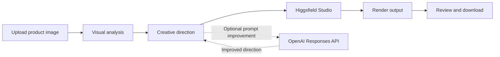
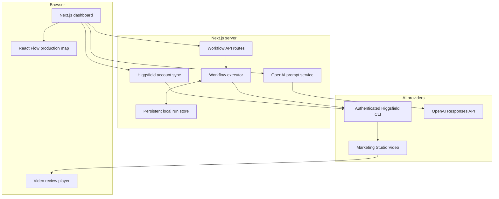

<div align="center">

# Voomara UGC Ads

### Turn one product image into a complete, visible AI UGC video workflow.

Voomara is an open-source production dashboard for creating vertical product videos with Higgsfield. Upload a product image, add creative direction, follow every stage on a live node canvas, and review the generated video without leaving the application.

[](LICENSE)
[](https://nextjs.org/)
[](https://www.typescriptlang.org/)
[](https://higgsfield.ai/cli)

[Live product](https://ugc-flow-studio-nine.vercel.app/) · [Dashboard](https://ugc-flow-studio-nine.vercel.app/dashboard) · [Issues](https://github.com/rajvictor1/voomara-ugc-ads/issues)

</div>

---


## Overview

Most AI video tools hide production behind a spinner. Voomara represents product intake, visual analysis, creative direction, video generation, rendering, and delivery as explicit nodes with persistent state. It supports two honest runtime modes:

- **Local CLI:** real paid generation through an authenticated Higgsfield account.
- **Public demo:** a credit-free Vercel presentation using the bundled project video; it never claims the sample is generated from the upload.

## Core capabilities

- Product image drag-and-drop, validation, preview, replacement, and removal
- Server-side OpenAI prompt improvement with original-input preservation on failure
- User-controlled generated audio
- Live React Flow canvas with six production stages and failure states
- Persistent local JSON workflow records and refresh-safe polling
- Real Higgsfield Marketing Studio execution through the authenticated CLI
- Live Higgsfield plan and credit synchronization
- Embedded vertical-video review and download
- Credit-free Vercel preview for presentations and onboarding
- Responsive Voomara landing page, demo login, dashboard, and light/dark mode

## Workflow



Each node has an explicit lifecycle:

```text
pending -> running -> completed
                   -> failed
```

## Architecture



The canvas visualizes persisted state; it does not execute the provider. Credentials, orchestration, uploaded files, and provider commands remain on the server.

## Technology stack

| Layer | Technology | Responsibility |
| --- | --- | --- |
| Application | Next.js 16 App Router | UI, server routes, production build |
| Interface | React 19 + React Flow | Dashboard state and interactive production map |
| Language | TypeScript 5 | Shared workflow contracts |
| Styling | Tailwind CSS 4 + Voomara CSS | Tokens, responsive layout, landing experience |
| Validation | Zod | Provider and request response validation |
| AI video | Higgsfield CLI / Marketing Studio | UGC generation and account status |
| Prompt improvement | OpenAI Node SDK / Responses API | Production-ready creative direction |
| Persistence | Local JSON run store | Development run state and polling |
| Deployment | Vercel | Public credit-free presentation mode |

## Repository structure

```text
voomara-ugc-ads/
├── app/
│   ├── api/
│   │   ├── higgsfield/account/    # Live plan and credit synchronization
│   │   ├── prompt/improve/        # Server-side OpenAI prompt improvement
│   │   ├── runtime/               # Public-demo or local-cli capability
│   │   └── workflows/             # Create, list, and inspect workflow runs
│   ├── dashboard/                 # Product-to-UGC production studio
│   ├── login/                     # Demonstration login journey
│   ├── globals.css                # Voomara tokens and workflow styling
│   ├── layout.tsx                 # Metadata and theme restoration
│   └── page.tsx                   # Public landing page
├── components/
│   ├── workflow/                  # React Flow canvas and custom production node
│   └── theme-toggle.tsx           # Light and dark appearance setting
├── lib/
│   ├── higgsfield/                # Provider command execution boundary
│   ├── workflow/                  # Definition, executor, and persistent store
│   └── runtime.ts                 # Runtime-mode selection
├── types/                         # Shared workflow contracts
├── public/                        # Project-owned static assets and demo video
├── .env.example                   # Safe configuration template
├── LICENSE                        # MIT License
└── package.json
```

Generated uploads and run records are intentionally excluded from Git.

## Prerequisites

- Node.js 22.13 or newer
- npm 10 or newer
- A Higgsfield account with generation credits for live mode
- The authenticated Higgsfield CLI on the machine running Next.js
- An OpenAI API key only when prompt improvement is required

## Install and authenticate Higgsfield

Install the official CLI with npm:

```bash
npm install -g @higgsfield/cli
higgsfield auth login
higgsfield workspace list
higgsfield workspace set <workspace_id>
higgsfield account status --json
```

The final command must return the authenticated account, selected workspace, plan, and credit balance before a live workflow can run.

## Local setup

```bash
git clone https://github.com/rajvictor1/voomara-ugc-ads.git
cd voomara-ugc-ads
npm install
cp .env.example .env.local
npm run dev
```

Open [http://localhost:3000](http://localhost:3000). Keep `UGC_RUNTIME_MODE=local-cli` for real generation. Never commit `.env.local`.

## Using Voomara

1. Choose or drag a JPG, PNG, or WebP product image into the product card.
2. Confirm the preview and edit the creator direction.
3. Optionally select **Improve prompt** to use OpenAI.
4. Choose whether generated audio is enabled.
5. Select **Run workflow** for live Higgsfield generation.
6. Watch all six nodes move through their persisted states.
7. Review and download the completed video from the output panel.

Use **Preview without credits** for a presentation that must not start paid generation.

## Current generation defaults

| Setting | Value |
| --- | --- |
| Higgsfield model | `marketing_studio_video` |
| Mode | `ugc` |
| Aspect ratio | `9:16` |
| Duration | 15 seconds |
| Resolution | 720p |
| Audio | User-controlled |
| Provider timeout | 30 minutes |

## API routes

| Method | Route | Purpose |
| --- | --- | --- |
| `GET` | `/api/runtime` | Returns the safe runtime capability |
| `GET` | `/api/higgsfield/account` | Returns live connection, plan, and credits |
| `POST` | `/api/prompt/improve` | Rewrites creative direction through OpenAI |
| `GET` | `/api/workflows` | Lists local workflow runs |
| `POST` | `/api/workflows` | Validates input, creates a run, and starts execution |
| `GET` | `/api/workflows/:runId` | Returns the latest state of one run |

## Higgsfield MCP

Higgsfield MCP can let an AI agent discover models and launch generations from a compatible client. It is useful for trainer-led agent workflows, but it is **not** the backend used by this repository. Voomara follows the trainer repository's application architecture and invokes the authenticated CLI from server-side code. This separation prevents an MCP client session from being mistaken for deployable application infrastructure.

## Vercel deployment boundary

Set `UGC_RUNTIME_MODE=public-demo` on Vercel. A serverless deployment cannot inherit the OAuth credential and selected workspace from a developer's laptop, and long CLI subprocesses are not a safe production queue. A real multi-user cloud release should replace the local CLI adapter with an authorized remote Higgsfield API/worker and use durable object storage, PostgreSQL, a job queue, authentication, rate limits, and cost controls.

## Validation

```bash
npm run lint
npm run build
```

## Security boundaries

- OpenAI credentials are read only by the server route.
- Higgsfield account queries and generation commands execute only on the server.
- Live uploads are validated, limited to 12 MB, and stored outside `public/`.
- Environment files, product uploads, and run records are ignored by Git.
- Provider errors preserve the prompt and appear inside the studio.
- The public demo uses only a project-owned video and consumes no credits.

## Reference

Voomara is an independently branded implementation created after studying [harshith-vaddiparthy/UGC-dashboard](https://github.com/harshith-vaddiparthy/UGC-dashboard). The provider boundaries, workflow state model, and generation defaults intentionally match the learned production pattern; Voomara retains its own landing experience and visual system.

## License

Released under the [MIT License](LICENSE).

---

<div align="center">Voomara — make the product the main character.</div>
