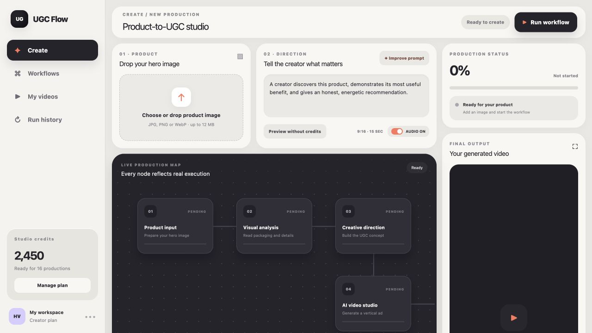
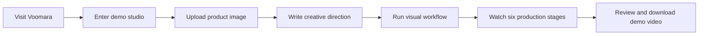
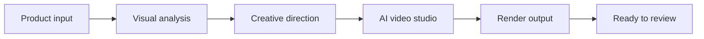
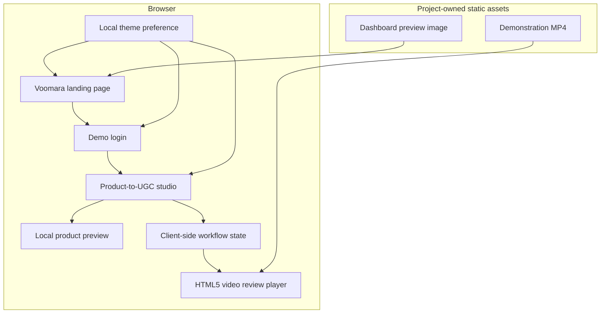
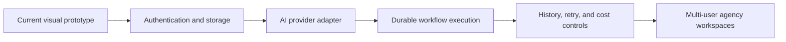

<div align="center">

# Voomara

### One product image. One visible workflow. A complete UGC video experience.

Voomara is a polished, open frontend prototype for turning a product image into a transparent AI-style UGC production workflow. Upload a product, shape the creative direction, watch six visual stages execute, and review the final video without leaving the dashboard.

[](https://nextjs.org/)
[](https://react.dev/)
[](https://www.typescriptlang.org/)
[](https://tailwindcss.com/)
[](https://ugc-flow-studio-nine.vercel.app/)

[Live product](https://ugc-flow-studio-nine.vercel.app/) · [Dashboard](https://ugc-flow-studio-nine.vercel.app/dashboard) · [Report an issue](https://github.com/rajvictor1/voomara-ugc-ads/issues)

</div>

---



## Overview

Most AI video products hide their work behind a loading spinner. Voomara explores a clearer experience: product intake, visual analysis, creative direction, video generation, rendering, and delivery are represented as explicit nodes on a visual production map.

The current repository is a **frontend product prototype**. It provides a complete, credit-free demonstration of the intended experience, including a local sample result video. It does not yet call a commercial AI video-generation provider, persist workflow runs, or authenticate real users. Those boundaries are documented below so the project can be extended without confusing demonstration behavior with production infrastructure.

## Who it is for

| Audience | How Voomara helps |
| --- | --- |
| Founders and product owners | Validate an AI UGC product experience before committing to provider and infrastructure costs. |
| Creators | Explore a simple product-to-video workflow without learning a traditional editing timeline. |
| Creative agencies | Demonstrate a clear client-facing production journey from product intake to review. |
| Marketing teams | Align product imagery, creative direction, workflow status, and output review in one interface. |
| Developers and AI consultants | Use a focused Next.js frontend as the presentation layer for a future generation backend. |

## Current capabilities

- Premium responsive landing page with product storytelling and a 3D workflow hero
- Persistent light and dark appearance settings
- Demo login journey that leads into the production studio
- Product-image selection through file picker or drag and drop
- Image MIME-type validation, local preview, replacement, and removal
- Editable creative-direction prompt with a demonstration prompt-improvement action
- User-controlled audio preference
- Six-stage visual production map with pending, running, and completed states
- Animated workflow progress and current-stage messaging
- Credit-free demonstration run for presentations and product validation
- Embedded final-video playback from a project-owned MP4 asset
- Play and download actions for the completed demonstration output
- Clear video-load failure state instead of a silent or empty player
- Responsive desktop and mobile layouts
- Production deployment on Vercel

## Product journey



## Workflow



Each visual node moves through this lifecycle:

```text
pending -> running -> completed
```

The progress percentage represents completion across the six simulated stages. It is not progress reported by an external AI model.

## Current architecture



### Design principles

1. **Make generation understandable.** Every major production stage is visible instead of being hidden behind one spinner.
2. **Keep input and output together.** Product selection, direction, status, and video review remain inside one studio.
3. **Be truthful about runtime behavior.** The current workflow is explicitly a frontend demonstration until a provider backend is connected.
4. **Fail visibly.** If the result video cannot load, the output panel presents a clear recovery message.
5. **Preserve user preferences locally.** Theme choice is stored on the device without requiring an account.
6. **Design mobile intentionally.** The workflow, result, and marketing experience remain usable on smaller screens.

## Technology stack

| Layer | Technology | Responsibility |
| --- | --- | --- |
| Application | Next.js 16 App Router | Routes, metadata, rendering, and production builds |
| Language | TypeScript 5 | Type-safe components and interactions |
| Interface | React 19 | Upload, workflow, player, and theme state |
| Styling | Tailwind CSS 4 plus custom CSS | Brand system, responsive layout, 3D presentation, and workflow visuals |
| Theme persistence | Browser `localStorage` | Remembers light or dark mode on the device |
| Product preview | Browser object URLs | Displays the selected product image locally |
| Video review | Native HTML5 video | Plays and downloads the bundled demonstration result |
| Deployment | Vercel | Public Next.js production hosting |
| Package manager | npm | Dependency installation and reproducible builds |

## Repository structure

```text
voomara-ugc-ads/
├── app/
│   ├── dashboard/
│   │   └── page.tsx              # Upload, prompt, workflow, and video studio
│   ├── login/
│   │   └── page.tsx              # Demonstration login journey
│   ├── globals.css               # Complete Voomara design and responsive system
│   ├── layout.tsx                # Metadata and initial theme restoration
│   └── page.tsx                  # Public Voomara landing page
├── components/
│   └── theme-toggle.tsx           # Persistent light/dark mode control
├── public/
│   ├── dashboard-preview.png      # Landing-page product preview
│   ├── demo-ugc.mp4               # Project-owned demonstration output
│   └── favicon.svg                # Browser icon
├── tests/                         # Starter test infrastructure
├── .openai/hosting.json           # Sites hosting configuration
├── next.config.ts                 # Next.js configuration
├── package.json                   # Scripts and dependencies
├── package-lock.json              # Reproducible npm dependency lock
└── README.md                      # Product and engineering brief
```

Build output, installed dependencies, local environment variables, and Vercel project metadata are excluded from Git.

## Routes

| Route | Purpose |
| --- | --- |
| `/` | Public landing page and product explanation |
| `/login` | Lightweight demonstration login |
| `/dashboard` | Interactive product-to-UGC workflow studio |

## Prerequisites

- Node.js 22.13 or newer
- npm 10 or newer
- A modern browser with JavaScript enabled

No API key is required for the current demonstration workflow.

## Local setup

### 1. Clone the repository

```bash
git clone https://github.com/rajvictor1/voomara-ugc-ads.git
cd voomara-ugc-ads
```

### 2. Install dependencies

```bash
npm install
```

### 3. Start the development server

```bash
npm run dev
```

Open [http://localhost:3000](http://localhost:3000).

### 4. Create a production build

```bash
npm run build
npm run start
```

## Using Voomara

1. Open the landing page and select **Create your first ad**.
2. Submit the prefilled demonstration login form.
3. Choose or drag a JPG, PNG, or WebP product image into the product card.
4. Review the local preview and use **Replace** or **Remove** when needed.
5. Edit the creative direction for the intended creator-style advertisement.
6. Choose whether the future generated output should include audio.
7. Select **Run workflow** after adding an image, or use **Preview without credits** for an immediate demonstration.
8. Watch all six workflow nodes update in sequence.
9. Play or download the result from the final output panel.

## Current demonstration defaults

| Setting | Value |
| --- | --- |
| Workflow type | Client-side simulation |
| Production stages | 6 |
| Intended format | Vertical `9:16` |
| Intended duration | 15 seconds |
| Audio | User-controlled preference |
| Demonstration result | Bundled project MP4 |
| Provider credits | Not required |
| Persistence | Current browser session only |

## Validation and quality checks

Run the following before publishing application changes:

```bash
npm run lint
npm run build
```

The production build performs TypeScript validation and statically generates the public routes.

## Security and operational boundaries

- The current application does not collect or upload the selected product image to a server.
- Product previews use temporary browser object URLs and disappear when the session ends.
- The login form is for demonstration only and does not authenticate or store credentials.
- The bundled result video is a sample asset, not an AI generation based on the uploaded product.
- No third-party AI-provider keys are required or included.
- No database, user account, billing record, or workflow history is created.
- Local environment files and Vercel project metadata are excluded from Git.

Before accepting real users, a production version should add secure authentication, server-side validation, object storage, a transactional database, a durable workflow engine, provider-secret management, rate limits, usage controls, and content-safety checks.

## What is not implemented yet

The following items are product roadmap work—not current capabilities:

- Product-image analysis through a vision model
- Real prompt improvement through an LLM
- AI UGC video generation through Higgsfield or another provider
- Provider-level progress reporting and cancellation
- Durable uploads, generated assets, and workflow history
- User authentication and workspace ownership
- Usage credits, subscriptions, and billing
- Retry, failure recovery, notifications, and cost tracking
- Client brand kits, reusable templates, and creator avatars

## Production roadmap



### Recommended next milestones

1. Add production authentication and protected dashboard routes.
2. Store product uploads in Vercel Blob, S3, or Cloudflare R2.
3. Introduce a provider-neutral video-generation interface.
4. Connect the first supported AI video provider through server-only credentials.
5. Persist runs, node status, outputs, timestamps, and errors in PostgreSQL.
6. Move long-running generation into a durable queue or workflow runtime.
7. Add history, retry, cancellation, notifications, and cost visibility.
8. Add usage limits, subscriptions, and multi-user workspaces.

## Deployment

The production application is currently deployed on Vercel:

**[https://ugc-flow-studio-nine.vercel.app/](https://ugc-flow-studio-nine.vercel.app/)**

To create another Vercel deployment:

```bash
npx vercel
```

To publish to production:

```bash
npx vercel --prod
```

## Reference and learning context

Voomara was developed as an independent Next.js implementation after studying the visual workflow ideas demonstrated in [harshith-vaddiparthy/UGC-dashboard](https://github.com/harshith-vaddiparthy/UGC-dashboard). Voomara has its own branding, landing experience, component structure, styling system, and frontend demonstration runtime.

## Contributing

Contributions and focused improvement proposals are welcome.

1. Fork the repository.
2. Create a focused feature branch.
3. Make the change and update documentation when behavior changes.
4. Run `npm run lint` and `npm run build`.
5. Open a pull request explaining the change, reasoning, validation, and operational impact.

Do not include API keys, account credentials, customer product images, private generated media, or other sensitive assets in issues or pull requests.

## License

No open-source license has been added to this repository yet. Public visibility does not by itself grant permission to copy, modify, or redistribute the code. Add an explicit license before inviting external reuse or commercial forks.

---

<div align="center">

**Voomara — make the product the main character.**

</div>
